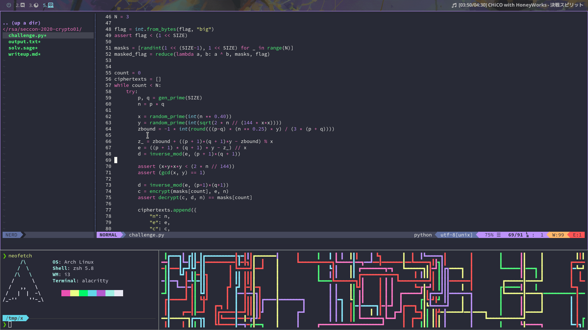
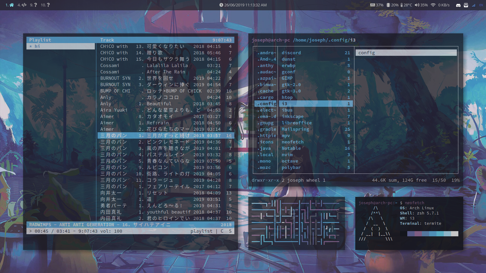
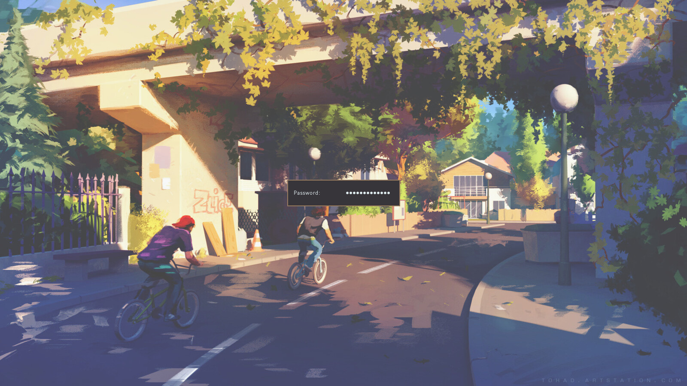
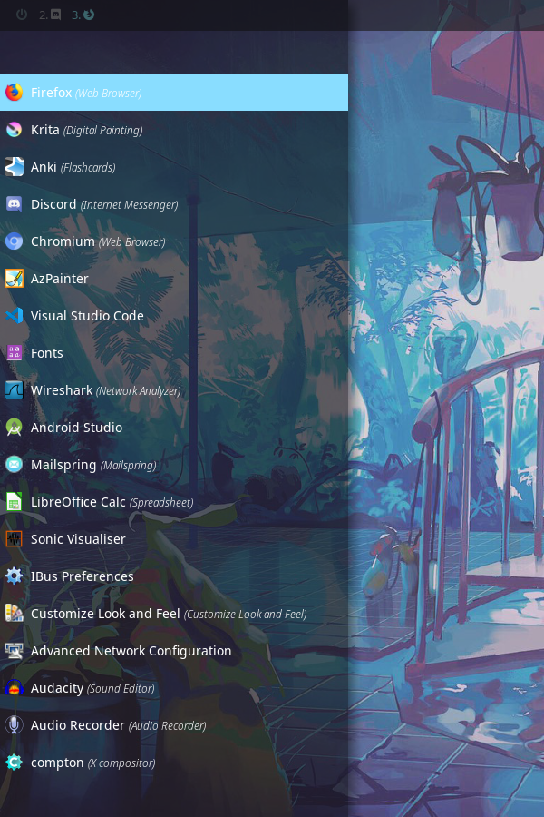
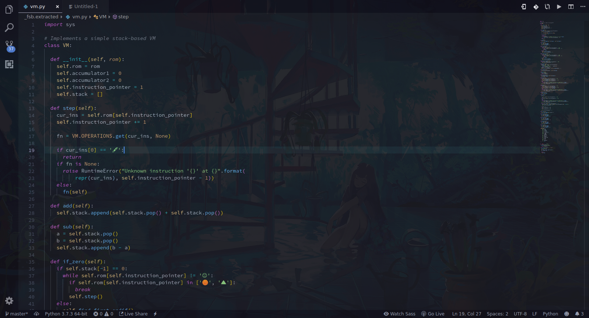
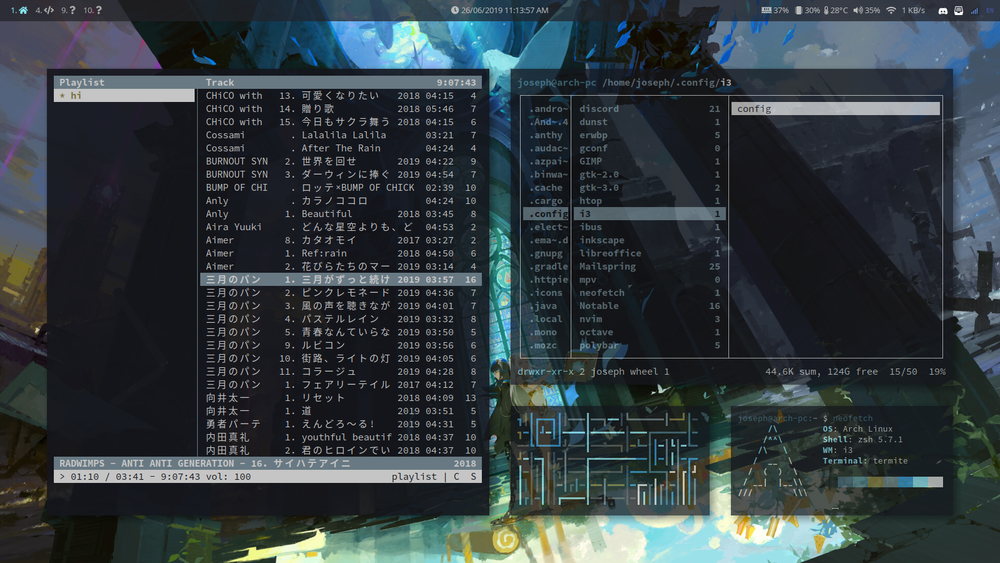

# dotfiles

Dotfiles for my Arch Linux systems running on a Thinkpad X230 laptop and a desktop PC

### Programs:
- Window Manager: i3-gaps
- Status Bar: polybar
- Application Menu: rofi
- Terminal: termite
- Display Manager + Greeter: lightdm + lightdm-mini-greeter
- Text Editors: nvim / vscode
- Screenshots: maim + xclip
- Notifications: dunst
- File Manager: ranger
- PDF Viewer: zathura
- Browser: Firefox
- Image Viewers: feh / sxiv
- Music Player: cmus
- Colour Generator: pywal (haishoku backend)

## greeter
This is [my own fork](https://github.com/josephsurin/lightdm-mini-greeter) of [prikhi's](https://github.com/prikhi/lightdm-mini-greeter)

## polybar

One bar for each monitor:

## rofi

## vscode

## dunst

## pywal

